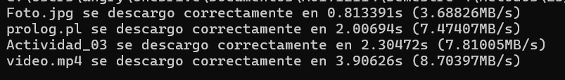
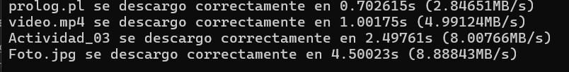
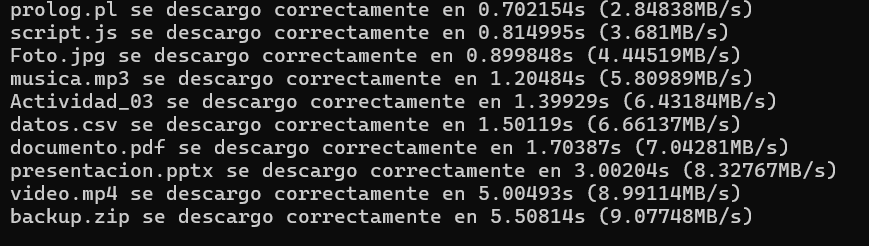

# E3_Paradigma
A01712114 - Omar Emilio Casillas Alday

# Descripción
La idea de este programa es simular la descarga de varios archivos de diferentes tamaños al mismo tiempo, sacar cuanto tarda en descargar y a que velocidad la descargó.
Importante mencionar qeu esto solo es una simulación del comportamiento que tendría un sistema al descargar muchos archivos.
Esto es importante ya que lo pensé como una parte de un tester para probar en comportamiento de una aplicación o sistema bajo muchas tareas en paralelo, de igual manera esta podría extenderse a herramientas que analizan el rendimiento de sistemas de archivos.

# Modelos
Mi programa primero define una función que simula la descarga de un archivo, entra el nombre del archivo y su supuesto peso, mide el tiempo que tomó la descarga, calcula la velocidad y muestra los resultados.
En el main se crea la lista de archivos con los supuestos tamaños, se crea 1 thread para cada archivo para trabajarlos de manera simultanea y espera a que los threads se terminen para acabar el programa.
Para este proyecto ocupamos el paradigma concurrente, este segun códigofacilito "El poder realizar múltiples cosas en el mismo tiempo, pero, no específicamente en paralelo", esa podría realizarse de manera paralela si el sistema lo permite, pero esto no lo controlo desde el codigo, la concurrencia no garantiza que las descargas se ejecuten al mismo tiempo, a comparacion del paralelo que este lo hace con varios nucleos.
https://codigofacilito.com/articulos/programacion-concurrente

# Implementación
Primero que nada incluimos las librerias adecuadas, iostream para entradas y salidas estandar, threads para poder utilizar los hilos para la concurrencia, chrono para trabajar con los tiempos y duraciones y vector para guardar los archivos y threads en vectores
```c++
#include <iostream>
#include <thread>
#include <chrono>
#include <vector>
using namespace std;
```
Ahora podemos empezar creando nuestra función que simulará las descargas.
Tenemos una variable start que guardará el tiempo en el que entra a la función.
Ahora hacemos la simulación de espera, multiplicamos 500 (ya que al menos debe tardar algo en los archivos pequeños), por el supuesto tamaño del documento por 100 (tambien es un numero arbitrario para la simulación).
Tenemos la variable end donde se guarda el tiempo en el qeu se termina la espera de la descarga del archivo.
Una variable duración tipo double porque es mas precisa que un float, en esta guardamos la diferencia del tiempo final con el tiempo inicial.
Una variable speed donde guardaremos la velocidad a la que se descargó el archivo.
Por ultimo imprimimos los datos de descarga.
```c++
void simula_descarga(const string &nombre_doc, int size_doc){
    //auto sirve 
    //esta linea guarda el tiempo actual, ocupando un reloj muy presiso de la libreria chrono
    auto start = chrono::high_resolution_clock::now();
    //se pone un tiempo arbitrario para simular que hasta lo mas pequeño se tarda algo de tiempo en descargarse
    //igual el 100 fue elegido de manera arbitraria por MB
    this_thread::sleep_for(chrono::milliseconds(500 + size_doc * 100));

    //se usa auto ya que el tipo de este "chrono" es muy largo, y así evitamos ecribir mucho
    // este es el tipo real: std::chrono::time_point<std::chrono::high_resolution_clock>
    //esta linea calcula cuanto tiempo pasó en verdad
    auto end = chrono::high_resolution_clock::now();
    //Usamos double porque es mas preciso qeu float
    chrono::duration<double> duracion = end - start;
    //.count() extrae el valor numerico del objeto chrono (duración)
    double speed = size_doc/duracion.count();
    //imprimimos resumen 
    std::cout<<nombre_doc<<" se descargo correctamente en "<<duracion.count()<<"s ("<<speed<<"MB/s)"<<endl;

}
```
Por ultimo tenemos nuestro main donde creamos un vector de threads y otro donde guardemos el titulo y el peso del archivo, y comenzamos con nuestro for, el cual recorre cada elemento del vector de archivos y crea un thread en el que se ejecutará la función y así para cada elemento de docs.
Al final solo hacemos un join para esperar a que todos los threads se terminen de ejecutar.
```c++
int main(){
    //creamos el vector de threads
    vector<thread> threads;
    //creamos el vector con nuestros documentos y su supuesto peso
    //un pair es una estructura que guarda 2 valores juntos, como "pequeño paquete", para mas datos se usa structure o class, igual si se ocupa nombres mas claros
    vector<pair<string, int>> docs = {
        {"Foto.jpg", 3},
        {"video.mp4", 34},
        {"Actividad_03", 18},
        {"prolog.pl", 15}
    };
    //Ponemos los threads a trabajar con la función de arriba
    for (int i=0; i<docs.size();i++){
        threads.emplace_back(simula_descarga, docs[i].first, docs[i].second);
    }
    //antes de acabar el programa esperamos a que todos los threads se terminen de ejecutar
    for (int i = 0; i < threads.size();i++){
        threads[i].join();
    }

    return 0;
}
```
# Pruebas
Para corroborar que se ejecuten de manera simultanea, hacemos la prueba cambiando el peso de los archivos, se espera que el que pesa menos, sin importar si está antes o despues en el vector, se espera que los primeros en salir sean los archivos que pesan menos.

Para poder correr el programa hay que hacerlo en un compilador de c++
Si decides hacerlo en cmd de WINDOWS tienes que poner "cd" + `<la dirección de tu carpeta donde tienes el archivo>`.
Despues ejecutas este comando
g++ descarga.cpp -o a.exe
Y ejecutas el programa escribiendo 
a.exe 

Primera iteración:

* {"Foto.jpg", 3}
* {"video.mp4", 34}
* {"Actividad_03", 18}
* {"prolog.pl", 15}
Se espera que salgan en este orden 
1. Foto.jpg
2. prolog.pl
3. Actividad_03
4. video.mp4


Segunda iteración:
* {"Foto.jpg", 40}
* {"video.mp4", 5}
* {"Actividad_03", 20}
* {"prolog.pl", 2}
  
Se espera que salgan en este orden: 
1. prolog.pl
2. video.mp4
3. Actividad_03
4. Foto.jpg


Tercera iteración:
* {"Foto.jpg", 4}
* {"video.mp4", 45}
* {"Actividad_03", 9}
* {"prolog.pl", 2}
* {"documento.pdf", 12}
* {"musica.mp3", 7}
* {"datos.csv", 10}
* {"presentacion.pptx", 25}
* {"backup.zip", 50}
* {"script.js", 3}

Se espera que salgan en este orden: 
1. prolog.pl
2. script.js
3. Foto.jpg
4. musica.mp3
5. Actividad_03
6. datos.csv
7. documento.pdf
8. presentación.pptx
9. video.mp4
10. backup.zip


# Análisis
### Complejidad temporal
Para la simulación de la espera de tiempo, tiene una complejidad de O(n), donde n es el tamaño del archivo.
Gracias a los threads, la funcion para cada archivo se ejecuta de manera concurrente, el tiempo será casi igual al de la descarga mas lenta, dejandonos con la complejidad de O(n) (asumiendo que hay suficientes nucleos para cada thread, si no, la complejidad pasa a ser O(n*m) donde m es el numero de archivos)
### Otro paradigma 
Respecto a otras soluciones, le dije a Chat GPT que lo implementara el prolog, dejandome este codigo:
```prolog
% Regla para calcular el tiempo y la velocidad de descarga
% descarga(Nombre, Tamaño, Tiempo, Velocidad)
descarga(Nombre, Tam, Tiempo, Velocidad) :-
    Tiempo is (500 + Tam * 100) / 1000,
    Velocidad is Tam / Tiempo,
    format("~w se descargo correctamente en ~2f s (~2f MB/s)~n", [Nombre, Tiempo, Velocidad]).

% Predicado principal para ejecutar todas las descargas
descargas :-
    descarga("prolog.pl", 2, _, _),
    descarga("script.js", 3, _, _),
    descarga("video.mp4", 5, _, _),
    descarga("musica.mp3", 7, _, _),
    descarga("datos.csv", 10, _, _),
    descarga("documento.pdf", 12, _, _),
    descarga("Actividad_03", 20, _, _),
    descarga("presentacion.pptx", 25, _, _),
    descarga("Foto.jpg", 40, _, _),
    descarga("backup.zip", 50, _, _).
``` 
Este ocupa el paradigma logico, prolog no ejecuta de manera paralela ni concurrente, en éste se simula como conjunto de echos y reglas, no existe un metodo para calcular el tiempo en prolog, entonces este solo hace operaciones matematicas teniendo una complejidad de O(1), sin embargo, como este checa cada archivo de manera individual, su complejidad todal es de O(m).

### Comparación 
La implementación en C++ con threads permite simular varias descargas al "mismo tiempo" haciendo un buen escenario y realista para la simulación de un tester de velocidad, esta es mas compleja pero mas cercana a la realidad gracias a los hilos y el temporizador, mientras que prolog es mas teórica y declarativa, es bueno para mostrar la lógica del problema pero la limita la parte del tiempo que no hay algo qeu lo pueda calcular y la interacción con recursos del sistema (threads->nucleos).

# Bibliografía
(S/f). Codigofacilito.com. Recuperado el 22 de mayo de 2025, de https://codigofacilito.com/articulos/programacion-concurrente
